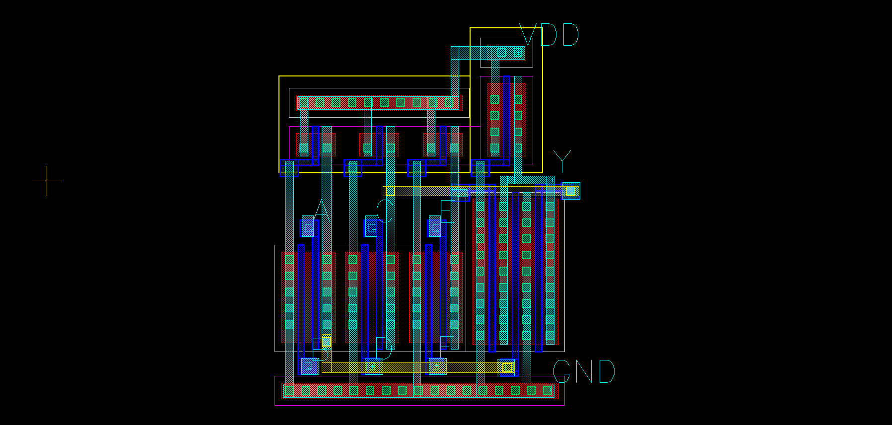

# VLSI Circuit Design
Time : 2022 spring (second half semester of junior)

## 課程

|科目|教授|
|:-:|:-:|
|[VLSI電路設計](http://class-qry.acad.ncku.edu.tw/syllabus/online_display.php?syear=0110&sem=2&co_no=E246200)|[張順志](https://www.ee.ncku.edu.tw/teacher/index2.php?teacher_id=71)|

## 環境
另外還需要`rule.drc`的DRC檔、`Rule.lvs`的LVS檔、`Rule.rce`的PEX檔這3個layout規則檔與`cic018.l`製程檔。
1. OS
- `CenterOS v6`

2. Software

|名稱|功能|
|---|---|
|Virtuoso|繪製並生成`*.cir`電路檔。|
|HSPICE|輸入為`*.cir`電路檔與`.*sp`測試檔，進行電路模擬。|
|Laker|畫電路layout的編輯器，並檢查有沒有符合DRC、LVS、PEX規則檔，可輸出萃取寄生電容的電路檔。|
|Matlab|將HSPICE電路模擬後的數據使用Matlab分析。|

## 檔案層級說明

|檔案|說明|
|---|---|
|`eda_tools_tutorial`|EDA tools的教學文檔。|
|`hspice`|`*.cir`電路與`.*sp`測試檔案，還另外需要匯入`cic018.l`，才可用HSPICE進行電路模擬。|
|`laker`|使用`laker`軟體生成layout檔案。|
|`matlab_script`|Matlab分析的script。|
|`report`|作業的問題與報告文檔。|
|`report_doc_original_file`|報告文檔的`*.docx`原檔。|
|`schematics`|使用`virtuoso`軟體繪製並生成`*.cir`電路。|

## lab1
完成以下HSPICE模擬與layout圖。
- transmission gates - 當NMOS的輸入(drain)端，控制(gate)端皆為$V_{DD}$時，輸出(source)端會從0開始增加，一直增加到$V_{DD} - V_{tn}$以上時，由於NMOS導通條件為$V_{GS} > V_{tn}$，因此NMOS會關掉，而維持在導通前的狀態$V_{DD} - V_{tn}$，所以我們會說NMOS是可以通過strong "0"，但是會通過weak(degraded) "1"，PMOS則相反。上述pass transistor這個問題，可以將NMOS與PMOS並聯，結合兩者優點，導通時時要傳0會走NMOS通道，要傳1會走PMOS通道，即為transmission gate。
- D latch - 真值表是CLK=0時，把上一個值latch(鎖)住，保持前一狀態，而CLK=1時，輸出follow輸入D值，使用兩個inverter串聯是作為buffer用，通過buffer即可將偏離最高(logic 1)和最低電壓(logic 0)值校正回來，提高電路的抗噪能力。
- D flip-flop - 可用上述兩個D latch串聯之架構實現，稱為master slave D flip-flop，當CLK=0時，master ON、slave OFF，訊號卡在slave前面，當CLK=1時，master OFF、slave ON，訊號通過slave並輸出，由於master關掉，訊號會維持(hold)，也就是說當CLK從0變到1的這個瞬間才會讀取值，稱為positive-edge trigger。
- multiplexer - 功能是從多個輸入訊號源中選擇一個訊號做為出入，這個選擇的機制是靠一個選擇訊號判別，當S=0時，輸出訊號follow輸入源D0；當S=1時，輸出訊號follow輸入源D1。
- AOI22 - 使用transmission gate實現的multiplexer，雖然只需要花4個電晶體，但是會有nonrestoring的問題，也就是說當輸入訊號受雜訊干擾時，由於輸出是follow輸入源，所以一樣會被干擾，尤其在經過多級的nonrestoring邏輯，訊號會失真到無法復原，因此我們改使用AOI22電路來實現，不過由於PMOS接pull-up network，NMOS接pull-down network，這個MUX所輸出訊號是反向的。
- pair of tristate inverters - 同前一題觀念，也可使用一對tristate inverter實現inverting multiplexer。
- AOI31 - 畫layout時會避免一條diffusion中斷，造成電路面積增加，因此需要找出一種polysilicon gate的順序能讓diffusion不會中斷，這就是Euler path(一筆畫)問題，將PMOS化成edge、source/drain端的接線化為node，從輸出端出發找Euler path，也可將NMOS化成edge，兩者畫出來的圖形是對偶的(dual)。Euler path為D-C-B-A。
- $Y=\overline{\left(AB+C\right)\cdot D}$- 同前一題觀念，Euler path為A-B-D-C。 
- 3 to 8 decoder - 使用2個2 to 4 decoder來實現，如上schematic圖，W0和W1分別接上兩個decoder輸入，而W2則作為選擇要使用哪個decoder，W2=0時，使用上面的decoder，W1=0時使用下面的decoder，EN則決定是否啟動這個系統。

一直到第三大題(AOI22)之後，我layout圖才比較"正常"一點，這次作業整體難度不難，電路圖在教授講義和網路上都查得到資料，而最花時間的是最後一題3 to 8 decoder，我使用2個2 to 4 decoder實現。
|schematic||
|---|---|
|waveform||
|layout||

## lab2
我學到五大點
- **熟悉HSPICE語法** 
尤其是第一大題，1A小題使用`.DC`鍵字做穩態分析、`sweep`關鍵字掃描電壓、`.PROBE`關鍵字將以下指定變數會輸出到波型檔；1D小題、1E小題使用`.MEA`關鍵字在特定情況下指定節點與時間資訊輸出數據到文字檔。

---

- **建立邏輯閘的linear delay model** 
1E小題、1F小題藉由計算值匯出至matlab做圖，建立linear delay model並與講義U20-6的理論值做比較。
$$d = \frac{t_{pd}}{\tau} = f + p = g\cdot h + p$$

---

- **評估不同電路架構的path delay time與最佳化一條path的delay time** 
第2大題最佳化4種電路架構的delay time並判斷哪種電路架構對於$H=\frac{C_{out}}{C_{in}}=\frac{1000fF}{10fF}=100$情況下較佳，最佳化一條path的delay time的流程如下
1. **計算path effort $F = GBH$。**
	- **path logic effort** 
	$G = \Pi g_i$，為此path上經過邏輯閘的類型，像是以$\mu_p : \mu_n = 1:2$的前提下，n-input NAND是$g = \frac{n + 2}{3}$、n-input NOR是$g = \frac{2n + 1}{3}$。
	- **path branching effort** 
	$B = \Pi b_i \;\text{where}\; b = \frac{C_{ \text{onpath} } + C_{ \text{offpath} } }{C_{ \text{onpath} }}$，為此path分支出來需要推別條路徑上邏輯閘的能力。
	- **path electrical effort** 
	$H = \Pi h_i = \frac{C_{out}}{C_{in}^{(1)}}\cdot\frac{ C_{out}^{(2)} }{ C_{in}^{(2)} }\cdot\ldots\cdot\frac{C_{out}^{(i)}}{C_{ \text{in} }} = \frac{C_{ \text{out} }}{ C_\text{in} }$，兩兩相消下，代表不需要知道電路內部架構，只需要將最後一級輸出電容除以最前一級輸入電容即可算出，這兩個參數題目會給定，可以想像現實工作時，我只take charge of這一塊的電路，前一塊和後一塊的電路是由另外其他人設計。
	- **原理** 
	根據linear delay model，路徑上 $\text{total delay}\; = \sum (p_i + g_ih_i) = \sum (p_i) + \sum(g_ih_i)$，我們目的就是最小化total delay，其中parasitic delay $p_i$與gate size $k$無關，因此目標改為$\min \sum(g_ih_i)$，再根據高一數學算幾不等式，表現算數平均與幾何平均的不等關係 $A_n \geq G_n \Rightarrow \frac{1}{n} (\sum_{k=1}^n x_k) \geq \sqrt[n]{\Pi_{k=1}^n x_k}$，因此要極小化算數平均，就是當算數平均等於幾何平均 $A_n = G_n$時，若且唯若等號成立$x_1 = x_2 = x_3 = \cdots x_n$，也就是$F^{ \frac{1}{n} } = g_1h_1 = g_2h_2 = \cdots = g_ih_i$，因此只需要計算path effort就可以知道各級邏輯閘的effort均為 $f = F^\frac{1}{n}$，代表delay time最小值發生在每一級推一樣的力道。
2. **決定要用幾級(stage)電路實現，delay time最佳值是每一級要推等效4個自己(fanout)，$F^{\frac{1}{N}} = 4 \Rightarrow N = \log_4 F$。**
	- **原理** 
	假設一個path effort是$F$、$n_1$級的邏輯電路，再向後內插$N - n_i$個inverter，因此得total delay為$\text{total delay} = NF^{\frac{1}{N}} + \sum_{i = 1}^{n_1}p_i + (N -n_1)p_{inv}$，將上式對$N$做偏微分=0取極值，並將$p_{inv} = 1$帶入得$F^{\frac{1}{N}} = 3.59$，取最接近整數$4$，代表每一級邏輯閘等效推4個自己，delay time會最小。
3. 計算此path最小delay time是 $D =  NF^{\frac{1}{N}} + P$，其中$P = \sum p_i$。
4. 計算各級邏輯閘的effort均為$\hat{f} = F^\frac{1}{N}$，原理如第一點。
5. **從後往前推，計算每一級的輸入電容值** $\hat{f} = gh = g\frac{C_{out}}{C_{in}}$。
6. **得到各級邏輯閘的$C_{in}$去決定電晶體的size**，假設一個2-input NAND gate計算得$C_{in} = 15$，而計算NMOS和PMOS取size的ratio為$4:1$，因此NMOS的size取12、PMOS的size取3，輸入源看進去的電容才會是$12+3=15$。

---

- **transistor foding的layout技巧** 
 
2F小題練習部分。參照這篇[文獻](https://hal.archives-ouvertes.fr/hal-02446833/document)裡面的做圖與描述，transistor folding就是**並聯2顆$W$砍半的電晶體**，如此等效上還是看到1顆$W$的電晶體，以降低diffusion面積，使寄生電容降低，從線性區電流公式也可以看出流經迴路的電流還是維持一致。
$$i \propto \frac{W}{L} = \underbrace{ \frac{ \frac{W}{2} }{L} + \frac{ \frac{W}{2} }{L}}_{ \text{transistor in parallel} }$$

---

- **分析邏輯閘的delay time** 

第3大題決定電晶體的size、計算layout優化後的寄生電容、計算六種不同輸入pattern下的delay time，分析電路的delay time的步驟如下
1. 為了使上下迴路RC充放電一致，要**先決定每一個電晶體的尺寸$\frac{W}{L}$，確保每一條通路的電阻值都相同**。
2. 使用RC delay model計算C值，快速方法是從一節點看有$i$個size是$k_i$的MOS，電容值即是$\sum^n_{i = 1}k_i$，至於GND和VDD不需要計算電容值，因為電容兩端電壓固定，所以電容不會充放電。
3. (如果考慮layout優化的問題時)當兩個MOS共用contact時，電容取兩個MOS的depletion capacitance的平均 $C_g = \frac{C_{g1} + C_{g2}}{2}$，若沒打contact時，depletion capacitance再砍半$\frac{1}{2}C_g$。
4. 決定出RC充放電值最大時的worst case。
5. 分別計算當**輸出上升**時的rising propagation delay time $t_{pdr}$與當**輸出下降**時的falling propagation delay time $t_{pdf}$。
6. 使用Elmore delay model，一次只看一個電容充放電行為並相加，計算propagation delay time $t_{pd} = \sum_{\text{nodes }i}R_{\text{i-to-source}}C_i$，代表用一階RC充放電去近似高階RC充放電I-V曲線，注意照理說取時間常數應該是$t_{pd} = R'C\ln2$，而為求計算方便一般取的$R$已隱含$R'\ln2$成分。

## lab3
用到power章節並結合之前speed章節的觀念。
- 1A、1B小題計算不同邏輯閘節點或是單一輸入訊號的activity factor。
- 1C小題計算dynamic power並與HSPCIE模擬power值做比較，以及探討改變rising/falling time對power的影響。
- 2A、2B小題用到speed章節的ring oscillator觀念，做presim和layout後的postsim驗證確定實際HSPCIE模擬值是否符合題目SPEC要求。
 
- 2C小題是vloltage-controlled ring oscillator這部分上課沒提及，不過用目前已知觀念還是可知最上面和最下面的MOS是current source，以此思路去調參數以符合SPEC要求。
- 3A小題為在”指定條件”下決定最小delay與最小power下電路的級數和個別電晶體的size。
- 3B小題決定最小power下電路的級數和個別電晶體的size。
- 3C小題首先判斷要使用哪種input pattern才能讓delay最小，而再根據最小delay的input pattern，去掃電晶體的size測量rising/falling delay和power，計算pdp，做size對pdp圖，模擬出最小power下個別電晶體的size值，並與3B小題的理論計算值做對照。 

## lab4
- 1A小題不同input order情況下charge sharing noise理論計算。
- 1B小題charge sharing noise的HSPICE模擬。
- 1C小題解決charge sharing noise的方法 - 使用secondary precharge或是keeper。

- 2A小題計算static CMOS, pseudo-nmos, domino不同電路種類與NAND6 and INV, NAND3 and NOR2, NAND3 and NOR2, INV and NOR6不同邏輯閘之間，最佳path delay與決定電晶體size。
- 2B小題模擬2A小題電路，並透過不同策略去優化delay time。
- 2C小題完成pseudo-nmos  NAND3 and NOR2的layout，萃取出寄生電容(R+C+CC)，並做HSPICE的postsim模擬。

---

詢問助教VLSI作業四1C小題，SPEC只要求輸出電壓大於$1.8 - 0.1 = 1.7V$即可，從DC transfer characteristics圖觀察，就算輸出電壓高於$V_{DD}$，對下一級電路來說也是判別為”1”，而低於$V_{DD}$比較危險，如果低於下一級電路的switching threshold voltage就會出問題。

可以使用secondary precharge，此時電壓高於$V_{DD}$是符合SPEC，發生原因為考慮寄生電容$V_{gd}$，電容一端為輸出$V_{DD}$，而另一端為原先的輸入值$0$，當輸入值從$0$變為$V_{DD}$時，為了維持電容兩端跨壓固定，另一端輸出會從$V_{DD}$衝到$2V_{DD}$，之後才會被下面的電容分壓掉，使電壓下降而停在$V_{DD}$到$2V_{DD}$之間。

可以使用keeper，但實務上需要控制不可以讓charge sharing noise影響的輸出電壓低於keeper負回授那顆inverter的switching threshold voltage，如果低於switching threshold voltage，這樣負回授那顆inverter判別為”0”，輸出則為1，PMOS就不開，就無法讓輸出電壓往上修正至$V_{DD}$。

---

static CMOS的計算方式前一次作業已經熟悉，這次要會pseudo-NMOS、footed dynamic gate、HI skew static gate這3種方式的計算流程。
- **pseudo-NMOS** 
	
	1. **電晶體size決定** 
	- 為了使ratioed circuit能與static CMOS比較基準一致，設定PMOS製造$\frac{I}{3}$電流、NMOS製造$\frac{4I}{3}$電流，對於falling時的淨(net)電流是$\frac{4I}{3} - \frac{I}{3} = I$，由於$I \cdot R = V_{DD} = \text{const.}$，要使NMOS製造$\frac{4I}{3}$電流，NMOS的size勢必要增大使電阻值降低，因此size $k = \frac{4}{3}$。
	- PMOS的size要除以4倍，但由於PMOS的mobility比較低($\mu_n:\mu_p = 2:1$)，所以再乘以2倍，因此size $k = \frac{2}{3}$。
	2. **logic effort計算** 
	 - 看進去的輸入電容只有NMOS的$\frac{4}{3}$，由於前面假設falling時的淨(net)電流是$\frac{4I}{3} - \frac{I}{3} = I$，所以$\frac{4}{3}$只需要除以unit inverter的輸入電容作normalize，得falling(down)的logic effort $g_d = \frac{4}{3} \cdot \frac{1}{3} = \frac{4}{9}$。
	 - 由於rising的電流是$\frac{I}{3}$比falling的電流$I$少3倍，因此上升的速度會慢3倍，logic effort會變大3倍，得rising(up)的logic effort $g_u = g_d \cdot 3 = \frac{4}{3}$。
- **footed dynamic gate** 
	1. **電晶體size決定** 
	由於CLK是對所有電路同時precharge，不需要在乎速度問題，所以為了降低寄生電容，PMOS電晶體的sizing會給最小；而pull-down電晶體的sizing則依照static CMOS的方式，使下方路徑維持在一個R。
	2. **logic effort計算** 
	只需要計算falling時的logic effort $g_d$，因為precharge階段把會先把輸出充至$V_{DD}$，而evaluate階段輸出電壓只有下降(falling)或是不下降兩種可能而已。
- **HI skew static gate** 
	1. **電晶體size決定** 
	選擇要favor rising變成HI-skew或是favor falling變成LO-skew，根據skew factor，一般設定為2倍，將不favor的path中電晶體的size縮小2倍，如此從輸入和輸出看進去的電容都會變小，對favor的路徑速度變快，但同時對不favor的path，由於電晶體的size縮小等效電阻增加，所以對不favor的路徑速度變慢。
	2. **logic effort計算** 
	在rising(up)的logic effort $g_u$維持**等效電路上相同的rise電阻**，調整inverter的電晶體至unskewed狀態，計算兩者比例$g_u = \frac{ g_{\text{HI-skew} } }{ g_{\text{unskewed inverter}} }$；在falling(down)的logic effort $g_d$維持**等效電路上相同的falling電阻**，調整inverter的電晶體至unskewed狀態，計算兩者比例$g_u = \frac{ g_{\text{HI-skew} } }{ g_{\text{unskewed inverter}} }$。

## lab5
- 第一題用到memories觀念，設計6T SRAM cell與周邊電路，並分析其穩定性 - 測量read與write operation時的static noise margin。 

- 第二題用到sequecing的觀念，自己決定好測資、要掃的變數值與範圍，畫出latch和flip flop的sequencing element delay，並由圖中分析得setup time等元件參數。 

---

- **6T SRAM架構、讀寫機制、決定電晶體的size** 
 
1. **儲存data方式** - N2、N4為access transistor；P1、N1和P2、N2互為cross-coupled inverter，一個inverter的輸出接到另一個inverter的輸入，形成正回授電路，當data有些微受到noise干擾，會透過正回授電路修正回0和VDD。
2. **layout技巧** - wordline是一條很長的導線，為了降低電阻值，會使用R小的metal和R大的polysilicon排成2條平行線，每隔一段距離打一個contact，形成R小的metal和R大的polysilicon的並聯，因此wordline電阻值就能減少。
3. **read operation** - $\phi_2 = 1$時bitline conditioning電路的PMOS打開，會先把bit和bit_b都precharge到$V_{DD}$，接下來$\phi_2 = 0$時，PMOS關閉bit和bit_b變為floating，再來wordline從0變為1，把N2、N4打開，假設A=0，會把原本precharge到$V_{DD}$的bit往下拉至0，代表把data讀出來，因此內部電晶體要比外部讀取電晶體還strong，$N1 > N2, N3 > N4$，最後再接一個HI-skew inverter，因為輸入只有下降的可能，因此要使用(對輸出)rising速度較快的HI-skew inverter。
3. **write operation** - 如同read operation，$\phi_2 = 1$時bitline conditioning電路的PMOS打開，會先把bit和bit_b都precharge到$V_{DD}$，接下來$\phi_2 = 0$時，PMOS關閉bit和bit_b變為floating，write driver根據要寫入data值會選擇要讓bit或是bit_b放電至0，接下來把wordline從0變為1，把N2、N4打開，把bit或是bit_b寫入這個cross-coupled inverter裡面，假設A = 0, A_b = 1, bit = 1, bit_b = 0，bit寫1時，N3通與N4通，由於前面read operation已經有$N3 > N4$的條件，因此寫不進去；改考慮bit_b寫0時，P1通和N2通，因此設計使N2比P1還strong就可以讓資料寫入cross-coupled inverter裡面，總結條件為$N2 > P1, N4 > P2$。

---

- **分析SRAM的穩定性 - static noise margin** 
前面考慮的是SRAM電晶體大小的設計，再來是分析SRAM維持/讀/寫值的穩定性，定義static noise margin(SNM)，分別在不同操作狀態下的SNM個別為hold margin, read margin, write margin，意義為施予多少noise下會使cross-cupled inverter失去原來stable的狀態。 

- **hold margin** - 由於在hold mode時，**access transistor關掉，因此只會看到2顆inverter的loop**，在2顆inverter之前接電壓源$V_1, V_2$，改變$V_1$觀察輸出結果；改變$V_2$觀察輸出結果，繪製出兩條DC transfer curve，即為bufferfly diagram，圖中兩條DC transfer curve圍出來最大正方形面積的邊長就是static noise margin(SNM)。藉由增加$V_{DD}$改變尺度或是增加$V_t$加大DC transfer curve的斜率，都可以讓hold margin加大。
- **read margin** - 就read operation"導通一開始"的瞬間做static分析，會看到左右兩邊各一顆導通的accesss transistor接上precharge的高電位，由於PMOS always ON，所以DC transfer curve不可能降至0，因此**read margin一定會小於hold margin**。由於前面read operation電晶體size的限制，beta ratio (strength of pull down transistor / access transistor)一定大於0，如果提高beta ratio，access transistor變得更不容易導通，DC transfer curve最低點會更接近0，因此read margin增加；與hold margin同理增加$V_{DD}$或是增加$V_t$，都可以讓read margin加大。
- **write margin** - 與read margin差別在於左右兩邊導通的accesss transistor一邊是接上precharge的高電位，而另一邊是接上precharge的高電位再被write driver放電後的低電位。$V_1$的DC transfer curve與read margin相同，但$V_2$是往左邊移，因為weak inverter輸出為1時，要與一端接0的strong的access transistor做分壓。如果讓write margin加大，要設法讓access transistor加大(等效wordline電壓加大)、pullup transistor變小，使$V_2$的DC transfer curve向左移動，更接近0。
- **注意事項** - 在PVT製程變異下，hold margin, read margin, write margin都不能有負值，否則電路運作會出問題；static noise margin大部分取決於$V_{DD}$大小，所以儘管製程推進，$V_{DD}$還是不能降到更低；static noise margin是保守static分析，實際上noise不是常數、bitline不是永遠precharged到高電位等，所以也有另一種分析方式 - dynamic noise margin。

---

- **flip flop與latch的setup time, hold time等元件參數定義** 
- 就flip flop而言，輸入到輸出的delay $t_{DQ}$分為$t_{DC}$到$t_{CQ}$，當輸入在CLK之前越早到，也就是$t_{DC}$越大，內部節點越早settle好，delay $t_{CQ}$就越小；$t_{DQ} = t_{DC} + t_{CQ}$作圖，$t_{CQ}$是x軸斜率恆為1，因此在y軸$t_{CQ}$的斜率為-1時，兩者相加斜率為0，代表**在$t_{DQ}$的極(小)值，在此點定義$t_{setup}, t_{pcq}$，而在$t_{DC}$較大處定義$t_{ccq}$**。
- 就flip flop而言，輸入上升後就馬上下降，會使輸出無法轉態成功，隨著falling edge到CLK兩者時間間距越小，較"容易轉態"，delay時間才會越小；定義hold time是在**維持與setup time相同的sequencing overhead** $t_{CQ} = t_{pcq}$之下的$t_{DC}$值，由於一般hold time都是發生在CLK來之前，所以hold time都是負的，記為$-t_{hold}$。
- 實際上輸入0和1的$t_{setup}, t_{pcq}, t_{hold}$都不一樣；定義**aperture width代表在clock edge前後會有一段時間data不可改變**，如果改變可能會造成metastable或是無窮時間的delay，分為rising input的aperture width $t_{ar} = t_{setup1} + t_{hold0}$和falling input的aperture width $t_{af} = t_{setup0} + t_{hold1}$。
- 就latch而言，當輸入比clock rising edge還早來 $t_{DCr} > 0$時，越早來，$t_{CrQ}$固定，$t_{DQ} = t_{DCr} + t_{CrQ}$增加；當輸入比clock rising edge還晚來 $t_{DCr} < 0$時，$t_{CrQ} = t_{CrD} + t_{DQ}$增加，$t_{DQ}$固定， $t_{DCr}$繼續變小直到接近clock的falling edge，delay會快速增加，根據不同書的定義，這裡定義$t_{setup}$為$t_{DQ}$最小值以上$5\%$值。
- 當data在aperture window時間內改變，使delay變得比$t_{pcq}$大很多，可能會進入metastable state，暫態之中有一個穩定的點，理論上會停在該點電壓穩定，但這個穩定點周遭斜率很大，因此一旦有任何noise干擾，會拉回stable state，這個過程需要的時間稱為recovery time。
- 使用小訊號分析的結果後可知，要使訊號越早脫離metastable state，$\tau = RC$就要越小，從一階RC(LP filter)看，pole就是 $\omega = \frac{1}{RC} = \frac{1}{\tau}$，因此$\tau$越小，3dB頻率變大，bandwidth就越大；因此在設計電路時，為了使訊號越早脫離metastable state，會設法讓輸出節點看到的RC變小。
